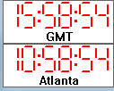

# WorldClock

`WorldClock` is a Windows API program I wrote in 1995.

This small program displays digital clocks on your monitor.  
You can have 1..n clocks displaying different time zones.

I'm putting it on GitHub because others might find it useful.  

n1kdo 20180128
